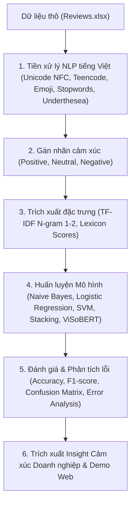

# Đồ Án Cuối Môn NLP: Phân Tích Cảm Xúc (Sentiment Analysis) Đánh Giá ITviec

## 1. Giới thiệu Đề tài
Dự án tập trung chuyên sâu vào bài toán **Phân tích Cảm xúc (Sentiment Analysis)** từ dữ liệu đánh giá của nhân viên và ứng viên trên nền tảng **ITviec**.

### Mục tiêu chính:
1. **Phân loại cảm xúc đa lớp (Multi-class Sentiment Classification):** Tự động phân loại đánh giá thành 3 sắc thái: **Tích cực (Positive)**, **Tiêu cực (Negative)**, **Trung tính (Neutral)**.
2. **So sánh đa dạng mô hình:** Thử nghiệm, tinh chỉnh và so sánh hiệu năng của ít nhất 4 thuật toán Machine Learning (Multinomial Naive Bayes, Logistic Regression, Linear SVM, Random Forest), mô hình kết hợp **Stacking Ensemble Classifier**, và mô hình Pretrained Transformer (**ViSoBERT / PhoBERT**).
3. **Phân tích Insight cảm xúc doanh nghiệp:** Trích xuất các từ khóa tích cực/tiêu cực đặc trưng (WordCloud) theo từng công ty công nghệ cụ thể và phân tích các yếu tố ảnh hưởng đến độ hài lòng của nhân sự.
4. **Xây dựng ứng dụng Demo (Deployment):** Tạo giao diện trực quan (Streamlit / Gradio) cho phép nhập đánh giá và dự đoán cảm xúc theo thời gian thực.

---

## 2. Cấu trúc thư mục (Project Structure)

```text
Do_An_Sentiment_Analysis/
├── data/
│   ├── raw/                 # Dữ liệu gốc (Reviews.xlsx, Overview_Companies.xlsx, ...)
│   ├── processed/           # Dữ liệu sau khi làm sạch và gán nhãn
│   └── dictionaries/        # Từ điển tiếng Việt (teencode, stopwords, emoji, ...)
├── notebooks/
│   ├── 01_data_exploration_eda.ipynb            # Khám phá & phân tích phân bố dữ liệu (EDA)
│   ├── 02_text_preprocessing.ipynb              # Tiền xử lý & chuẩn hóa tiếng Việt
│   ├── 03_sentiment_modeling_ml.ipynb           # Huấn luyện & tối ưu mô hình Machine Learning
│   ├── 04_sentiment_modeling_deeplearning.ipynb # Huấn luyện với ViSoBERT / Transformer
│   └── 05_company_sentiment_insights.ipynb      # Phân tích cảm xúc theo công ty & WordCloud
├── src/
│   ├── __init__.py
│   ├── preprocessing.py     # Pipeline làm sạch văn bản, chuẩn hóa tiếng Việt
│   ├── features.py          # Vector hóa văn bản (TF-IDF, BoW, Lexicon features)
│   ├── models.py            # Huấn luyện, đánh giá & so sánh mô hình phân loại
│   └── utils.py             # Hàm tiện ích (vẽ WordCloud, đọc dữ liệu)
├── models/                  # Lưu trữ checkpoint và mô hình (.joblib, .pkl)
├── reports/
│   ├── figures/             # Biểu đồ phân tích, Confusion Matrix, WordCloud cảm xúc
│   ├── final_report_outline.md # Đề cương chi tiết báo cáo đồ án
│   └── project_plan_and_work_assignment.md # Bảng phân công & timeline nhóm 4 người
├── requirements.txt         # Danh sách thư viện Python cần thiết
└── README.md                # Hướng dẫn tổng quan
```

---

## 3. Quy trình thực hiện (NLP Pipeline)



---

## 4. Hướng dẫn cài đặt & Thực thi

### Cài đặt môi trường
```bash
pip install -r requirements.txt
```

### Các bước thực hiện theo thứ tự Notebooks:
1. Chạy `notebooks/01_data_exploration_eda.ipynb` để khám phá phân bố số sao rating và cảm xúc.
2. Chạy `notebooks/02_text_preprocessing.ipynb` để làm sạch dữ liệu văn bản và xuất ra `data/processed/reviews_cleaned.xlsx`.
3. Chạy `notebooks/03_sentiment_modeling_ml.ipynb` để huấn luyện, tinh chỉnh tham số và so sánh các mô hình Machine Learning.
4. (Tùy chọn) Chạy `notebooks/04_sentiment_modeling_deeplearning.ipynb` để thử nghiệm mô hình Transformer (ViSoBERT).
5. Chạy `notebooks/05_company_sentiment_insights.ipynb` để xuất biểu đồ thống kê cảm xúc và WordCloud theo từng công ty.
