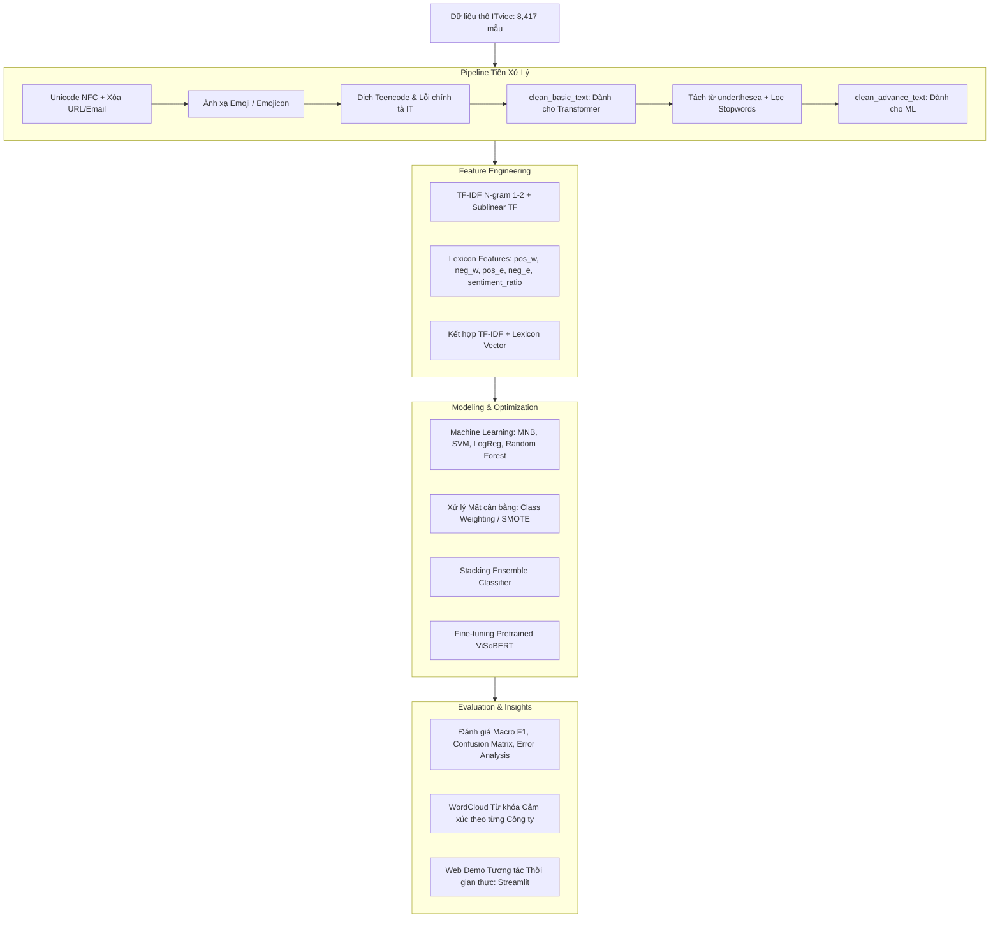

# Đồ Án Cuối Môn NLP: Phân Tích Cảm Xúc (Sentiment Analysis) Đánh Giá ITviec

## 1. Giới thiệu Đề tài
Dự án tập trung chuyên sâu vào bài toán **Phân tích Cảm xúc (Sentiment Analysis)** từ dữ liệu đánh giá của nhân viên và ứng viên trên nền tảng **ITviec**.

* **Repository:** [https://github.com/mrkiss-it/NLP-Sentiment-Analysis-ITviec](https://github.com/mrkiss-it/NLP-Sentiment-Analysis-ITviec)

### Mục tiêu chính:
1. **Phân loại cảm xúc đa lớp (Multi-class Sentiment Classification):** Tự động phân loại đánh giá thành 3 sắc thái: **Tích cực (Positive)**, **Tiêu cực (Negative)**, **Trung tính (Neutral)**.
2. **So sánh đa dạng mô hình:** Thử nghiệm, tinh chỉnh và so sánh hiệu năng của ít nhất 4 thuật toán Machine Learning (Multinomial Naive Bayes, Logistic Regression, Linear SVM, Random Forest), mô hình kết hợp **Stacking Ensemble Classifier**, và mô hình Pretrained Transformer (**ViSoBERT / PhoBERT**).
3. **Phân tích Insight cảm xúc doanh nghiệp:** Trích xuất các từ khóa tích cực/tiêu cực đặc trưng (WordCloud) theo từng công ty công nghệ cụ thể và phân tích các yếu tố ảnh hưởng đến độ hài lòng của nhân sự.
4. **Xây dựng ứng dụng Demo (Deployment):** Tạo giao diện trực quan (Streamlit / Gradio) cho phép nhập đánh giá và dự đoán cảm xúc theo thời gian thực.

---

## 2. Ý tưởng & Phương pháp Tiếp cận Xử lý (Methodology & Pipeline Architecture)

### 2.1. Thách thức đặc thù của Dữ liệu ITviec
- **Pha trộn ngôn ngữ (Code-switching):** Review ngành công nghệ chứa mật độ cao thuật ngữ tiếng Anh IT (*OT, layoff, micromanage, benefit, review, deploy, probation,...*).
- **Teencode & Viết tắt:** Sử dụng nhiều từ viết tắt, tiếng lóng (*cty, mn, k, lm, cx, mk, vđ, dc,...*).
- **Biểu tượng cảm xúc (Emoji / Emojicon):** Chứa nhiều icon thể hiện cảm xúc mạnh (*:), :((, 😡, ❤️, 👍*).
- **Mất cân bằng dữ liệu (Class Imbalance):** Đánh giá tích cực (Positive ~73.8%) chiếm đa số áp đảo so với Neutral (~19.5%) và Negative (~6.7%).

### 2.2. Sơ đồ Luồng Xử lý Tổng thể (End-to-End Pipeline)



### 2.3. Ý tưởng Xử lý Cốt lõi
1. **Chuẩn hóa văn bản 2 tầng (Dual-tier Normalization):**
   - `clean_basic_text`: Giữ nguyên cấu trúc ngữ pháp tự nhiên, chỉ chuẩn hóa teencode và emoji sang từ vựng có nghĩa -> Tối ưu cho mô hình ngôn ngữ sâu (**ViSoBERT / PhoBERT**).
   - `clean_advance_text`: Tách từ ghép tiếng Việt và lọc bỏ stopwords nhiễu -> Tối ưu không gian vector cho các mô hình học máy truyền thống (**SVM, Naive Bayes, Logistic Regression**).
2. **Trích xuất đặc trưng kết hợp (Hybrid Features):** Kết hợp giữa trọng số ngữ nghĩa tần suất **TF-IDF (Unigram + Bigram)** cùng với **đặc trưng từ điển cảm xúc Lexicon** (`pos_w`, `neg_w`, `sentiment_ratio`) để cung cấp thêm tín hiệu cảm xúc trực tiếp cho bộ phân loại.
3. **Xử lý Mất cân bằng lớp (Handling Class Imbalance):** Tích hợp trọng số lớp nghịch đảo (`class_weight='balanced'`) và tinh chỉnh ngưỡng quyết định để tránh thiên lệch về lớp chiếm đa số (Positive).
4. **Mô hình hóa đa tầng & Ensemble:** So sánh từ mô hình xác suất cơ sở (Multinomial NB) đến mô hình biên cực đại (Linear SVM), mô hình tuyến tính (Logistic Regression) và kết hợp thông qua **Stacking Ensemble** để khai thác điểm mạnh của từng thuật toán.

---

## 3. Phân chia Công việc Nhóm (Team Assignment)

| Thành viên | Phân công | Kế hoạch chi tiết |
| :--- | :--- | :--- |
| **👑 TV1: Hoàng Hôn** *(Trưởng nhóm)* | `Business & Data Processing` | [Xem kế hoạch TV1](reports/member_plans/TV1_HoangHon_Business_DataProcessing.md) |
| **👨‍💻 TV2: Văn Duy** | `Feature Engineering & EDA` | [Xem kế hoạch TV2](reports/member_plans/TV2_VanDuy_FeatureEngineering_EDA.md) |
| **👨‍💻 TV3: Duy Khang** | `Modeling & Hyperparameter Tuning` | [Xem kế hoạch TV3](reports/member_plans/TV3_DuyKhang_Modeling_Tuning.md) |
| **👨‍💻 TV4: Thành Trung** | `Evaluation, Sentiment Insights & Deployment` | [Xem kế hoạch TV4](reports/member_plans/TV4_ThanhTrung_Evaluation_Deployment.md) |

* Toàn bộ kế hoạch tổng hợp: [reports/project_plan_and_work_assignment.md](reports/project_plan_and_work_assignment.md)

---

## 4. Cấu trúc thư mục (Project Structure)

```text
Do_An_Sentiment_Analysis/
├── data/
│   ├── raw/                 # Dữ liệu gốc (Reviews.xlsx, Overview_Companies.xlsx, ...)
│   ├── processed/           # Dữ liệu sau khi làm sạch và gán nhãn
│   └── dictionaries/        # Từ điển tiếng Việt (teencode, stopwords, emoji, ...)
├── notebooks/
│   ├── 01_data_exploration_eda.ipynb            # Khám phá & phân tích phân bố dữ liệu (EDA)
│   ├── 02_text_preprocessing.ipynb              # Tiền xử lý & chuẩn hóa tiếng Việt
│   ├── 03_sentiment_modeling_ml.ipynb           # Huấn luyện & tối ưu mô hình Machine Learning
│   ├── 04_sentiment_modeling_deeplearning.ipynb # Huấn luyện với ViSoBERT / Transformer
│   └── 05_company_sentiment_insights.ipynb      # Phân tích cảm xúc theo công ty & WordCloud
├── src/
│   ├── __init__.py
│   ├── preprocessing.py     # Pipeline làm sạch văn bản, chuẩn hóa tiếng Việt
│   ├── features.py          # Vector hóa văn bản (TF-IDF, BoW, Lexicon features)
│   ├── models.py            # Huấn luyện, đánh giá & so sánh mô hình phân loại
│   └── utils.py             # Hàm tiện ích (vẽ WordCloud, đọc dữ liệu)
├── models/                  # Lưu trữ checkpoint và mô hình (.joblib, .pkl)
├── reports/
│   ├── figures/             # Biểu đồ phân tích, Confusion Matrix, WordCloud cảm xúc
│   ├── final_report_outline.md # Đề cương chi tiết báo cáo đồ án
│   ├── project_plan_and_work_assignment.md # Bảng phân công & timeline nhóm 4 người
│   └── member_plans/        # File kế hoạch hành động chi tiết riêng của 4 thành viên
├── requirements.txt         # Danh sách thư viện Python cần thiết
└── README.md                # Hướng dẫn tổng quan
```

---

## 5. Hướng dẫn Thành viên Clone & Phối hợp trên Git (Git Workflow)

### Bước 1: Clone dự án về máy
```bash
git clone https://github.com/mrkiss-it/NLP-Sentiment-Analysis-ITviec.git
cd NLP-Sentiment-Analysis-ITviec
```

### Bước 2: Cài đặt môi trường & Thư viện
```bash
pip install -r requirements.txt
```

### Bước 3: Tạo nhánh (Branch) riêng cho từng thành viên
Mỗi thành viên tạo và làm việc trên một nhánh riêng biệt:
```bash
# Đối với TV1 (Hoàng Hôn):
git checkout -b feature/data-preprocessing

# Đối với TV2 (Văn Duy):
git checkout -b feature/eda-features

# Đối với TV3 (Duy Khang):
git checkout -b feature/modeling-tuning

# Đối với TV4 (Thành Trung):
git checkout -b feature/evaluation-insights-demo
```

### Bước 4: Commit & Đẩy code lên nhánh của mình
```bash
git add .
git commit -m "feat: mo ta cong viec da hoan thanh"
git push origin feature/<ten-nhanh-cua-ban>
```

---

## 6. Quy trình thực hiện Notebooks

1. **Giai đoạn 1 (EDA & Data):**
   - Chạy `notebooks/01_data_exploration_eda.ipynb` để khám phá phân bố số sao rating và cảm xúc.
   - Chạy `notebooks/02_text_preprocessing.ipynb` để làm sạch dữ liệu văn bản và xuất ra `data/processed/reviews_cleaned.xlsx`.
2. **Giai đoạn 2 (Modeling):**
   - Chạy `notebooks/03_sentiment_modeling_ml.ipynb` để huấn luyện, tinh chỉnh tham số và so sánh các mô hình Machine Learning.
   - (Tùy chọn) Chạy `notebooks/04_sentiment_modeling_deeplearning.ipynb` để thử nghiệm mô hình Transformer (ViSoBERT).
3. **Giai đoạn 3 (Insights & Demo):**
   - Chạy `notebooks/05_company_sentiment_insights.ipynb` để xuất biểu đồ thống kê cảm xúc và WordCloud theo từng công ty.

---

## 7. Bảng Theo dõi Tiến độ Hiện tại (Current Project Status)

*Cập nhật lần cuối: 27/08/2026*

| Hạng mục công việc | Phụ trách chính | Trạng thái | Chi tiết kết quả bàn giao |
| :--- | :--- | :---: | :--- |
| **1. Thiết lập dự án & Bộ từ điển** | **TV1: Hoàng Hôn** | ✅ **100% (Hoàn thành)** | Cấu trúc Repo, `requirements.txt`, bộ từ điển đầy đủ trong `data/dictionaries/` (*teencode, emojicon, positive/negative words & emoji, stopwords*). |
| **2. Pipeline Tiền xử lý & Gán nhãn** | **TV1: Hoàng Hôn** | ✅ **100% (Hoàn thành)** | Hoàn thiện module `src/preprocessing.py`, notebook `02_text_preprocessing.ipynb`. Xuất thành công `data/processed/reviews_cleaned.xlsx` (8,417 mẫu, 23 cột, gán nhãn 3 lớp: *6,208 Positive, 1,639 Neutral, 570 Negative*). |
| **3. Phân tích EDA & Đặc trưng TF-IDF** | **TV2: Văn Duy** | 🔄 **Đang thực hiện** | Nhận bàn giao dữ liệu sạch, thực hiện `01_data_exploration_eda.ipynb` và hoàn thiện module `src/features.py`. |
| **4. Huấn luyện Mô hình Machine Learning** | **TV3: Duy Khang** | ⏳ **Sẵn sàng triển khai** | Chuẩn bị chạy `03_sentiment_modeling_ml.ipynb` (4 thuật toán ML, Hyperparameter Tuning và Stacking Ensemble). |
| **5. Đánh giá, Insight & Web Demo** | **TV4: Thành Trung** | ⏳ **Sẵn sàng triển khai** | Chuẩn bị chạy `05_company_sentiment_insights.ipynb` (WordCloud công ty, Confusion Matrix) và xây dựng Web Demo (Streamlit/Gradio). |
| **6. Báo cáo tổng hợp & Slide thuyết trình** | **TV1 & Cả nhóm** | ⏳ **Giai đoạn tiếp theo** | Soạn thảo theo mẫu đề cương `reports/final_report_outline.md`. |
