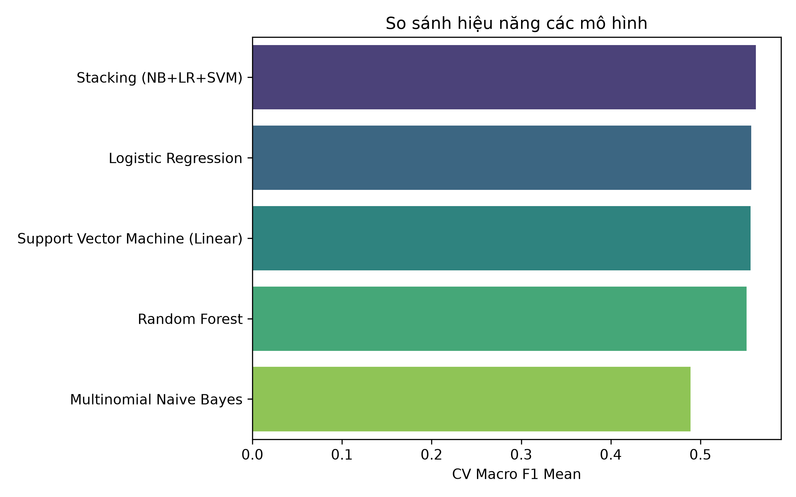
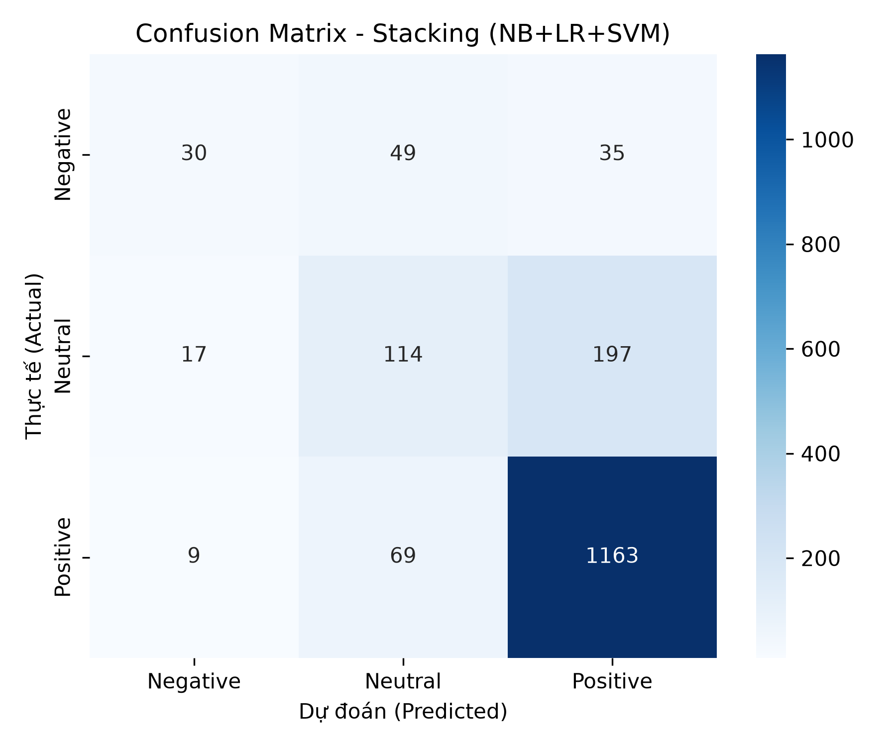

# Báo cáo TV3: Thiết kế mô hình học máy & Tinh chỉnh siêu tham số

## 3.2. Thiết kế các mô hình học máy

### Đầu vào

Toàn bộ mô hình dùng lại đúng artifact text-only do TV2 bàn giao (`models/train_test_features.joblib`): `X_train` (6.730 × 5.000), `X_test` (1.683 × 5.000, final test đã khóa), vector hóa bằng TF-IDF unigram+bigram, `sublinear_tf=True`. Notebook 03 chỉ nạp artifact qua `load_feature_split`, không fit lại TF-IDF.

### Bốn mô hình cơ sở

| Mô hình | Cấu hình | Vai trò |
|---|---|---|
| Multinomial Naive Bayes | `alpha` (tuned) | Baseline cổ điển cho phân loại văn bản |
| Logistic Regression | `class_weight='balanced'`, `C/solver/penalty` (tuned) | Mô hình tuyến tính chính, chịu được dữ liệu mất cân bằng |
| Linear SVM (`SVC(kernel='linear')`) | `class_weight='balanced'`, `probability=True`, `C` (tuned) | Tối ưu cho không gian TF-IDF nhiều chiều; `probability=True` để dùng được trong Stacking |
| Random Forest | `class_weight='balanced'`, `n_estimators/max_depth` (tuned) | Mô hình cây kết hợp, bắt tương tác phi tuyến |

Cả 4 mô hình đều dùng `class_weight='balanced'` (trừ Naive Bayes, vốn không hỗ trợ) để bù cho phân phối nhãn lệch (Positive 73,76% so với Negative 6,77%).

### Mô hình 5: Stacking Ensemble Classifier

Kết hợp 3 mô hình cơ sở tốt nhất — **Naive Bayes, Logistic Regression, Linear SVM** — làm base estimator, Logistic Regression làm meta-classifier tổng hợp (`StackingClassifier(cv=5)`). Stacking dùng đúng cấu hình siêu tham số đã tune ở Mục 3.3 cho từng base, không khởi tạo lại tham số mặc định.

### Mô hình 6: ViSoBERT (notebook 04)

`notebooks/04_sentiment_modeling_deeplearning.ipynb` đã chuẩn bị đầy đủ code benchmark zero-shot cho `5CD-AI/Vietnamese-Sentiment-visobert` trên đúng tập final test đã khóa (dùng `clean_basic_text` — giữ nguyên cấu trúc câu tự nhiên, đúng theo thiết kế tiền xử lý 2 tầng). **Notebook này chưa được thực thi**: môi trường dev không cài `torch`/`transformers` và không có GPU; sẽ chạy trên môi trường GPU (Runpod) theo kế hoạch của nhóm. Số liệu ViSoBERT sẽ được bổ sung vào bảng so sánh bên dưới sau khi chạy.

## 3.3. Xử lý mất cân bằng dữ liệu & Tinh chỉnh siêu tham số

### Xử lý mất cân bằng

Chiến lược chính là `class_weight='balanced'` trong hàm mất mát của từng mô hình (TV2 đã thử nghiệm SMOTE trong `src/features.apply_smote`; TV3 không áp SMOTE cho pipeline chính để giữ đúng phân phối gốc cho final test và tránh vector tổng hợp khó diễn giải trên không gian TF-IDF 5.000 chiều).

### Baseline (tham số mặc định, 5-Fold Stratified CV trên train)

| Mô hình | CV Macro F1 (mean) | Độ lệch chuẩn |
|---|---:|---:|
| Logistic Regression | 0,5567 | 0,0155 |
| Linear SVM | 0,5448 | 0,0114 |
| Random Forest | 0,5286 | 0,0370 |
| Multinomial Naive Bayes | 0,3460 | 0,0054 |

### Tinh chỉnh siêu tham số (GridSearchCV + 5-Fold Stratified CV, tối ưu Macro F1)

| Mô hình | Lưới tham số | CV Macro F1 sau tuning | Best Params |
|---|---|---:|---|
| Multinomial Naive Bayes | `alpha ∈ [0.01, 0.1, 0.5, 1.0, 2.0]` | 0,4890 | `alpha=0.1` |
| Logistic Regression | `C ∈ [0.1, 1, 5, 10]`, `solver ∈ [lbfgs, saga]`, `penalty ∈ [l1, l2]`* | 0,5567 | `C=1.0, penalty=l2, solver=lbfgs` |
| Linear SVM | `C ∈ [0.1, 0.5, 1, 2, 5]` | 0,5561 | `C=0.1` |
| Random Forest | `n_estimators ∈ [100, 200]`, `max_depth ∈ [10, 20, None]` | 0,5515 | `n_estimators=200, max_depth=20` |

\* Lưới LR được tách thành 2 nhánh (`lbfgs`+`l2` và `saga`+`{l1,l2}`) vì `lbfgs` không hỗ trợ `penalty='l1'`.

So với baseline, tuning cải thiện rõ rệt Naive Bayes (+0,143), Random Forest (+0,023, đồng thời giảm mạnh độ lệch chuẩn từ 0,037 xuống ổn định hơn) và Linear SVM (+0,011); Logistic Regression giữ nguyên vì cấu hình mặc định đã là điểm tối ưu trong lưới tìm kiếm.

### So sánh với Stacking Ensemble

| Mô hình | CV Macro F1 (train) |
|---|---:|
| **Stacking (NB + LR + SVM đã tune)** | **0,5619** |
| Logistic Regression (tuned) | 0,5567 |
| Linear SVM (tuned) | 0,5561 |
| Random Forest (tuned) | 0,5515 |
| Multinomial Naive Bayes (tuned) | 0,4890 |

Stacking Ensemble cho CV Macro F1 cao nhất trên train và được chọn làm mô hình cuối cùng.

### Đánh giá Final Test (đánh giá đúng 1 lần, sau khi đã khóa lựa chọn mô hình)

| Chỉ số | Giá trị |
|---|---:|
| Accuracy | 0,7766 |
| Macro F1 | 0,5475 |

| Lớp | Precision | Recall | F1 | Support |
|---|---:|---:|---:|---:|
| Negative | 0,5357 | 0,2632 | 0,3529 | 114 |
| Neutral | 0,4914 | 0,3476 | 0,4071 | 328 |
| Positive | 0,8337 | 0,9371 | 0,8824 | 1.241 |

Macro F1 trên final test (0,5475) thấp hơn ước lượng CV trên train (0,5619), một khoảng chênh hợp lý phản ánh phương sai giữa các fold chứ không phải rò rỉ dữ liệu (final test chỉ được dùng đúng 1 lần, sau khi mô hình đã được khóa bằng CV). Recall lớp Negative (26,32%) vẫn là điểm yếu rõ nhất — đúng như dự đoán từ EDA của TV2 về mất cân bằng dữ liệu nghiêm trọng (Negative chỉ 6,77% mẫu); đây là hạng mục TV4 cần đào sâu ở Error Analysis.

## Tệp bàn giao

- Module: `src/models.py` (`SentimentModelTrainer.tune_hyperparameters`, `get_stacking_model`, `plot_model_comparison`).
- Notebook hoàn chỉnh: `notebooks/03_sentiment_modeling_ml.ipynb` (đã thực thi, có output thật).
- Notebook chuẩn bị sẵn, chưa thực thi (chờ GPU): `notebooks/04_sentiment_modeling_deeplearning.ipynb`.
- Mô hình tốt nhất: `models/best_sentiment_model.joblib` (Stacking NB+LR+SVM).
- Biểu đồ: `reports/figures/model_comparison_f1_macro.png`, `reports/figures/best_model_confusion_matrix.png`.
- Test tự động: `tests/test_models.py`.
